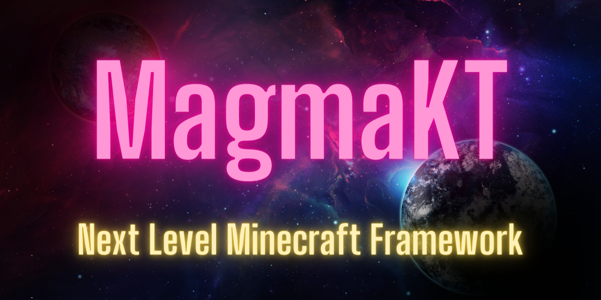

> **MagmaKT is still in development and currently not suitable for productive servers!**

## What is MagmaKT?
MagmaKT is a Minecraft plugin framework to simplify the rapid development of plugins. MagmaKT contains a unified and cross-platform api for config files, commands, gui's and many more. The API can be connected to other systems through modules without having to change a single line of code in the developed plugins.

## Various ways to use modules
A module can help to quickly add features that almost every plugin needs e.g. chat system, tablist, scoreboard. Modules can also be used to connect other platforms like cloud systems to the MagmaKT api.

## Currently supported platforms
Currently MagmaKT is compatible with Paper Servers and Bungeecord. Velocity and Sponge support will also be added later. Not all features are available for all platforms yet. But it is being worked on

## Minecraft servers that use MagmaKT
- Keeeks.de (Currently under development)

## Add MagmaKT to your project
### Add MagmaKT via Jitpack
Add the Jitpack maven repository

	allprojects {
		repositories {
			maven { url 'https://jitpack.io' }
		}
	}
Add the dependency to your project

	dependencies {
	        implementation 'de.jalumu:MagmaKT:main-SNAPSHOT'
	}

## MagmaKT Statistics
